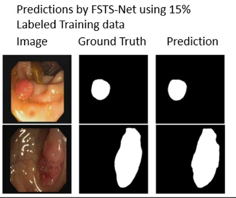

# FSTS-Net: Feature-mixing aided Semi-supervised Teacher-Student Network for Polyp Image Segmentation

This repository contains the **predicted segmentation masks**  of FSTS-Net as presented in our paper:

**FSTS-Net: A Feature-mixing aided Semi-supervised Teacher-Student Network for Polyp Image Segmentation**

[FSTS-Net Predictions](image/pred.png)

  

